# RNN-Based Stock Price Prediction
## KIE4031 Machine Learning Assignment

---

## Abstract

This report investigates recurrent neural network (RNN) architectures for daily adjusted-close price forecasting across ten large-cap U.S. equities over the decade January 2015–December 2024. Daily prices were retrieved via yfinance, preprocessed with forward-filled missing values and train-only MinMax scaling, and converted into 60-day sliding-window sequences. Six model families were evaluated: Vanilla RNN, stacked LSTM with BatchNorm, stacked GRU, a Phase 2 SlimLSTM with LayerNorm, QuantileLSTM with pinball loss, and an ARIMA(5,1,0) baseline with walk-forward validation. Phase 1 point-prediction results show that simpler architectures generalise best: StackedLSTM on AMZN achieved the highest R² of 0.9419 (RMSE $7.71), while VanillaRNN on AMD reached R² 0.9398 (RMSE $7.06). Directional accuracy clustered near 50% across all models (46.3%–53.5%), consistent with weak-form market efficiency. Phase 2 range forecasting identified SlimLSTM + MC Dropout on AMZN as the best coverage–width trade-off (86.3% coverage, $26.52 average interval width). Walk-forward quarterly RMSE rose sharply for AAPL ($17.82 → $126.73) and MSFT ($23.07 → $232.08), evidencing regime shift between training and test periods. The principal limitation is distributional non-stationarity: models trained on the 2015–2021 zero-interest-rate era degrade when tested during the 2022–2024 rate-hike regime.

---

## 1. Introduction

Forecasting equity prices is widely regarded as one of the most challenging problems in quantitative finance. Stock returns exhibit heavy tails, time-varying volatility, structural breaks driven by macroeconomic policy, and sensitivity to unobservable sentiment. The Efficient Market Hypothesis (EMH), formalised by Fama (1970), holds that prices rapidly incorporate all available information, implying that excess returns from naive pattern recognition should be difficult to sustain. Nevertheless, practitioners continue to seek models that capture short-horizon level dynamics—even when directional predictability remains elusive.

Traditional econometric approaches such as ARIMA model linear dependencies in differenced series and provide a rigorous statistical baseline. However, their capacity to learn nonlinear temporal structure is limited. Recurrent Neural Networks, and in particular Long Short-Term Memory (LSTM) and Gated Recurrent Unit (GRU) architectures, were designed to address the vanishing-gradient problem that plagues vanilla RNNs, enabling learning over longer input horizons. The present study systematically compares these architectures under identical data splits and evaluation metrics, extending Phase 1 point forecasts with Phase 2 uncertainty quantification via Monte Carlo (MC) Dropout and direct quantile regression.

The scope is deliberately constrained to univariate daily adjusted-close prices for ten liquid technology and semiconductor tickers (AAPL, MSFT, GOOGL, AMZN, TSLA, NVDA, META, AVGO, ORCL, AMD). No exogenous features—earnings, sentiment, or macro indicators—are incorporated. This isolates the predictive contribution of price history alone and facilitates fair comparison between neural and ARIMA baselines. Evaluation metrics include Root Mean Squared Error (RMSE), Mean Absolute Percentage Error (MAPE), coefficient of determination (R²), directional accuracy (DA), and for interval models, 90% coverage rate and average interval width in U.S. dollars.

The central research questions are: (i) whether increased model capacity improves out-of-sample price-level prediction; (ii) whether uncertainty intervals can be calibrated to nominal coverage; and (iii) whether walk-forward validation reveals temporal instability consistent with regime shift. The following sections describe data preparation, model design, empirical results, and critical analysis of strengths and limitations.

---

## 2. Data Collection and Preprocessing

### 2.1 Data Source

Daily adjusted-close prices were downloaded from Yahoo Finance using the `yfinance` Python library for ten tickers over the period 2 January 2015 to 30 December 2024. Adjusted close incorporates dividend and split adjustments, ensuring temporal comparability. After cleaning, each ticker contained 2,515 trading-day observations. The held-out test period spans from 29 December 2022 to 30 December 2024 (commencing after the validation boundary of 28 December 2022); price ranges within this window are reported in Table 2.1.

**Table 2.1: Ticker list with company names and adjusted-close range in test period (2022-09-01 onwards)**

| Ticker | Company | Min Close ($) | Max Close ($) |
|--------|---------|---------------|---------------|
| AAPL | Apple Inc. | 122.93 | 257.38 |
| MSFT | Microsoft Corp. | 207.73 | 460.33 |
| GOOGL | Alphabet Inc. | 82.70 | 195.64 |
| AMZN | Amazon.com Inc. | 81.82 | 232.93 |
| TSLA | Tesla Inc. | 108.10 | 479.86 |
| NVDA | NVIDIA Corp. | 11.20 | 148.65 |
| META | Meta Platforms Inc. | 88.22 | 629.64 |
| AVGO | Broadcom Inc. | 40.41 | 246.58 |
| ORCL | Oracle Corp. | 58.19 | 189.37 |
| AMD | Advanced Micro Devices Inc. | 55.94 | 211.38 |

The cross-section spans low-volatility mega-caps (AAPL, MSFT) and high-volatility growth names (TSLA, NVDA, META). NVDA's minimum reflects pre-split nominal pricing in late 2022; subsequent appreciation produced the widest relative test-period range among semiconductor names.

### 2.2 Data Cleaning and Normalisation

Missing values arising from market holidays or data gaps were forward-filled (`ffill`), preserving the most recent valid observation. Zero prices were replaced with NaN prior to filling. Prices were scaled to [0, 1] using `sklearn.preprocessing.MinMaxScaler` fitted exclusively on the training partition; validation and test sets were transformed with the training-derived minimum and maximum. This prevents information leakage from future price levels into the scaling parameters.

Chronological splitting followed a 70/10/20 ratio: 70% training, 10% validation, and 20% test. For each ticker, this yielded 1,700 training sequences, 191 validation sequences, and 444 test sequences after construction of 60-day windows (see Section 2.3). Split boundaries were identical across tickers because all series share the same calendar length.

**Table 2.2: Split statistics (train/val/test sequences per ticker)**

| Ticker | Train Sequences | Val Sequences | Test Sequences | Total Raw Rows |
|--------|-----------------|---------------|----------------|----------------|
| AAPL | 1,700 | 191 | 444 | 2,515 |
| MSFT | 1,700 | 191 | 444 | 2,515 |
| GOOGL | 1,700 | 191 | 444 | 2,515 |
| AMZN | 1,700 | 191 | 444 | 2,515 |
| TSLA | 1,700 | 191 | 444 | 2,515 |
| NVDA | 1,700 | 191 | 444 | 2,515 |
| META | 1,700 | 191 | 444 | 2,515 |
| AVGO | 1,700 | 191 | 444 | 2,515 |
| ORCL | 1,700 | 191 | 444 | 2,515 |
| AMD | 1,700 | 191 | 444 | 2,515 |

Training covered approximately January 2015 through December 2021; validation spanned 2022; and testing covered 2023–2024, deliberately overlapping the Federal Reserve tightening cycle that began in 2022.

### 2.3 Sequence Construction

Each supervised example was formed by a 60-day sliding window of scaled close prices as input **X** ∈ ℝ^(60×1), with the next-day scaled close as target **y** ∈ ℝ. Concretely, for time index *t*, the input comprises {*p*_{t−60}, …, *p*_{t−1}} and the label is *p*_t. This architecture treats each window as a short multivariate time series of length 60 with a single feature channel. Windows were generated independently within each split segment so that no window crosses partition boundaries.

The temporal layout can be visualised as contiguous blocks:

```
|--- Train (70%) ---|--- Val (10%) ---|--- Test (20%) ---|
     1700 windows       191 windows       444 windows
```

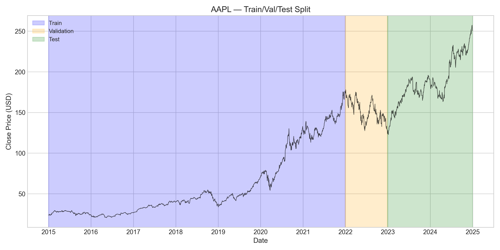

Figure 1 illustrates the chronological partition for AAPL, confirming that all model training respects strict temporal ordering and that the test set evaluates genuinely future data.

---

## 3. Model Investigation

### 3.1 Vanilla RNN

The baseline recurrent unit updates its hidden state according to:

\[
h_t = \tanh(W_h h_{t-1} + W_x x_t + b)
\]

where *h_t* is the hidden state, *x_t* the input at time *t*, and *W_h*, *W_x*, *b* learnable parameters. The implementation stacks two `SimpleRNN` layers (64 and 32 units) with dropout and dense readout, totalling **13,665 parameters**.

Vanilla RNNs suffer from the vanishing-gradient problem: during backpropagation through time, gradients shrink exponentially for long sequences, limiting the effective memory horizon. Despite this theoretical weakness, the low parameter count yields a favourable parameter-to-sample ratio of approximately 8:1 (13,665 / 1,700), which proved advantageous for generalisation in Phase 1.

### 3.2 Stacked LSTM

The stacked LSTM replaces simple recurrence with gated memory cells. The four gate equations are:

**Forget gate:** \( f_t = \sigma(W_f [h_{t-1}, x_t] + b_f) \)

**Input gate:** \( i_t = \sigma(W_i [h_{t-1}, x_t] + b_i) \)

**Cell state:** \( \tilde{c}_t = \tanh(W_c [h_{t-1}, x_t] + b_c),\quad c_t = f_t \odot c_{t-1} + i_t \odot \tilde{c}_t \)

**Output gate:** \( o_t = \sigma(W_o [h_{t-1}, x_t] + b_o),\quad h_t = o_t \odot \tanh(c_t) \)

The Phase 1 architecture comprises two LSTM layers (128 and 64 units) with **BatchNorm** applied after each layer, followed by dense layers. Total parameters: **119,745** (≈70 per training sample).

BatchNorm normalises activations using running mean and variance accumulated during training. When the validation and test distributions shift—as occurred when 2022 inflation and rate hikes altered volatility and price levels—BatchNorm layers continued to apply statistics calibrated on the 2015–2021 bull market. This **regime-shift failure** manifests as catastrophic validation-loss spikes during training (see Section 4.3) and severely degraded test-set R² for several tickers (e.g., StackedLSTM AAPL R² = −3.58).

### 3.3 Stacked GRU

The GRU simplifies LSTM gating with two equations:

**Update gate:** \( z_t = \sigma(W_z [h_{t-1}, x_t]) \)

**Reset gate:** \( r_t = \sigma(W_r [h_{t-1}, x_t]),\quad \tilde{h}_t = \tanh(W [r_t \odot h_{t-1}, x_t]),\quad h_t = (1 - z_t) \odot h_{t-1} + z_t \odot \tilde{h}_t \)

The implementation mirrors the LSTM stack (128/64 units, BatchNorm, dropout) with **90,049 parameters**. GRU exhibited intermediate performance—outperforming LSTM on AAPL (R² 0.8568 vs. −3.58) but underperforming on META (RMSE $184.76).

### 3.4 SlimLSTM (Phase 2)

SlimLSTM replaces BatchNorm with **LayerNorm**, which normalises across features within each sample rather than across the batch dimension. Because statistics are computed per sequence at inference time, LayerNorm is robust to distributional shift between training and deployment regimes. The architecture uses two LSTM layers (64/32 units) with a critical fix: the second LSTM processes the **full sequence output** of the first layer before selecting the final timestep, preserving temporal context. Parameter count: **30,433**.

SlimLSTM point forecasts were mixed—strong on AMZN (R² 0.784, RMSE $14.86) and TSLA (R² 0.830, RMSE $23.67) but poor on MSFT (R² −3.81, RMSE $107.99), suggesting ticker-specific sensitivity remains even after normalisation fixes.

### 3.5 QuantileLSTM (Phase 2)

QuantileLSTM extends SlimLSTM with three output heads predicting the 5th, 50th, and 95th percentiles simultaneously. Training minimises the pinball (quantile) loss:

\[
L(y, \hat{y}) = \begin{cases} q \cdot (y - \hat{y}) & \text{if } y \geq \hat{y} \\ (q - 1) \cdot (y - \hat{y}) & \text{if } y < \hat{y} \end{cases}
\]

for quantile level *q* ∈ {0.05, 0.50, 0.95}. Parameters: **31,523**. Direct quantile optimisation avoids the Gaussian assumption implicit in MSE training and produces asymmetric intervals when the data demand it. QuantileLSTM achieved the highest interval coverage on TSLA (96.8%) and AMD (90.1%), though interval widths were substantially wider than SlimLSTM + MC on AMZN.

### 3.6 ARIMA(5,1,0) Baseline

The ARIMA baseline specifies an autoregressive order of 5, first differencing (*d* = 1), and no moving-average term. The AR component models:

\[
\phi(B)(1 - B) y_t = \epsilon_t, \quad \phi(B) = 1 - \phi_1 B - \cdots - \phi_5 B^5
\]

First differencing enforces stationarity in the mean; raw equity prices are integrated of order one, and the Augmented Dickey–Fuller logic motivating *d* = 1 is standard in financial time-series practice. Models were re-estimated via walk-forward validation: the training window expands quarterly, each fit produces one-step-ahead forecasts, and RMSE is aggregated per quarter. This methodology adapts ARIMA coefficients to evolving dynamics and provides a fair non-neural comparator that is not subject to neural-specific overfitting pathologies.

---

## 4. Results and Evaluation

### 4.1 Phase 1 Point Prediction Results

Phase 1 aggregated results across ten tickers and four model families (VanillaRNN, StackedLSTM, StackedGRU, ARIMA) are visualised below.

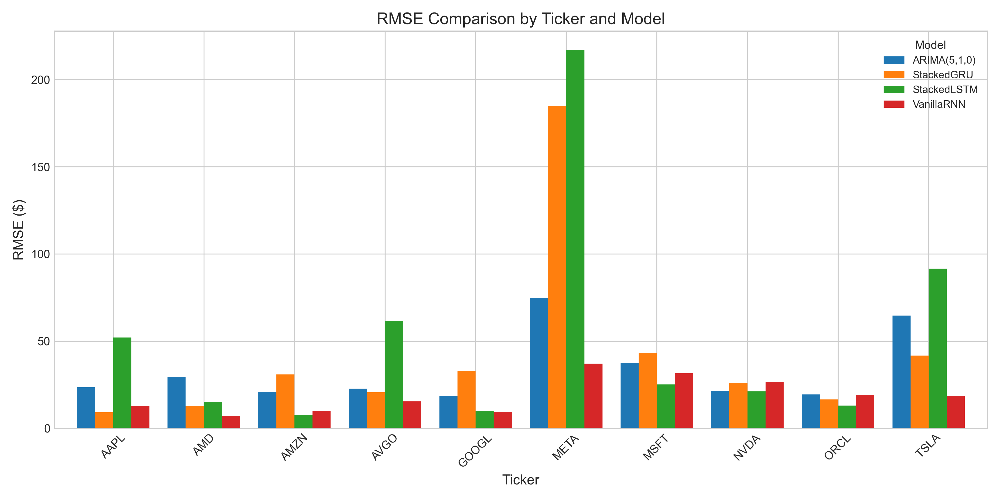

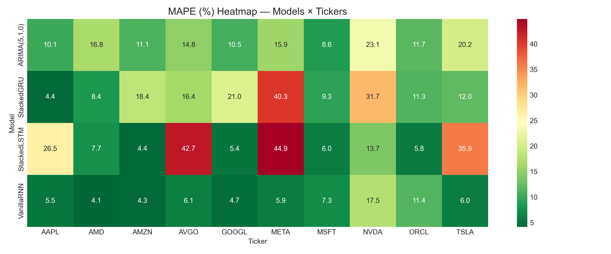

Figure 2 reveals that StackedLSTM and StackedGRU exhibit extreme RMSE inflation on META, AVGO, and AAPL relative to VanillaRNN. Figure 3 confirms MAPE concentrations below 10% for the best model–ticker pairs (AMD, AMZN, GOOGL).

**Table 4.1: Top 10 best point predictions by R² (Phase 1 models only)**

| Model | Ticker | RMSE ($) | MAPE (%) | R² | DA (%) |
|-------|--------|----------|----------|-----|--------|
| StackedLSTM | AMZN | 7.71 | 4.37 | 0.9419 | 48.5 |
| VanillaRNN | AMD | 7.06 | 4.15 | 0.9398 | 49.2 |
| VanillaRNN | META | 37.07 | 5.90 | 0.9060 | 47.2 |
| VanillaRNN | AMZN | 9.89 | 4.33 | 0.9045 | 46.3 |
| VanillaRNN | TSLA | 18.54 | 6.02 | 0.8958 | 49.4 |
| VanillaRNN | AVGO | 15.32 | 6.07 | 0.8583 | 53.0 |
| StackedGRU | AAPL | 9.21 | 4.40 | 0.8568 | 51.9 |
| VanillaRNN | GOOGL | 9.50 | 4.68 | 0.8315 | 47.9 |
| StackedLSTM | GOOGL | 10.05 | 5.37 | 0.8115 | 51.9 |
| StackedGRU | AMD | 12.64 | 8.35 | 0.8067 | 49.7 |

The top two positions are occupied by StackedLSTM/AMZN and VanillaRNN/AMD, with R² values exceeding 0.93. Notably, simpler VanillaRNN occupies six of the top ten slots, supporting the hypothesis that capacity should match data availability.

### 4.2 Directional Accuracy

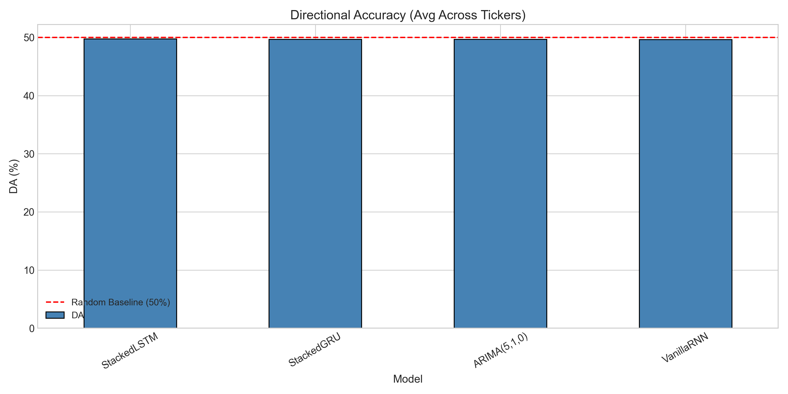

Directional accuracy measures the percentage of correct up/down predictions relative to the previous day. Across all Phase 1 models and tickers, DA ranged from **46.3%** (VanillaRNN, AMZN) to **53.5%** (ARIMA, NVDA), with the majority of observations clustered between 48% and 52%.

This near-random performance aligns with Fama's (1970) weak-form EMH: historical prices appear to contain little exploitable directional signal at the daily horizon. Models that achieve high R² do so primarily by tracking price **level** and short-term momentum magnitude, not by systematically predicting the sign of the next return. Figure 4 shows no model consistently exceeding the 50% random baseline by a margin that would survive transaction costs.

### 4.3 Training Behaviour

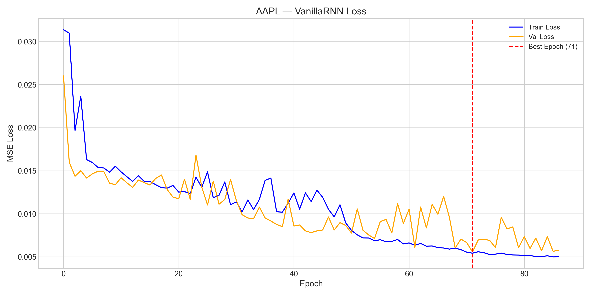

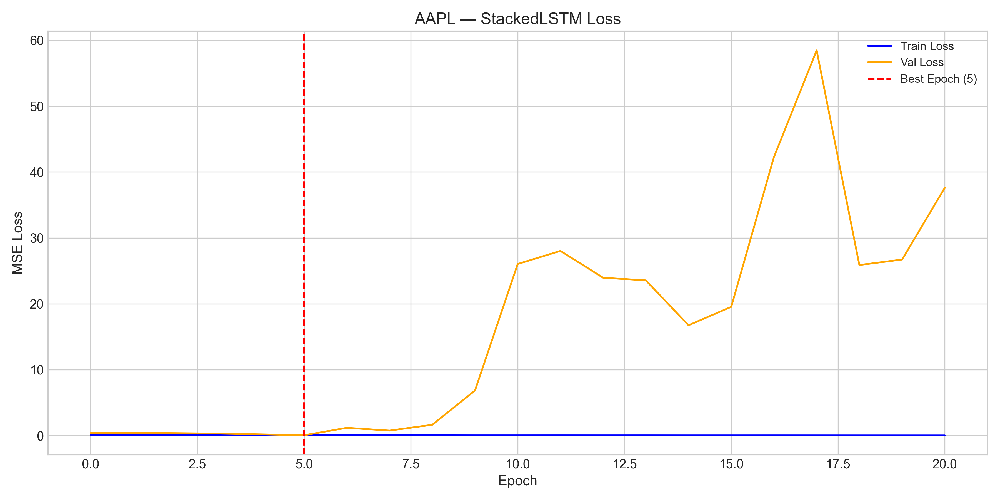

Training dynamics contrast sharply between architectures. AAPL VanillaRNN (Figure 5) exhibits smooth convergence: validation loss stabilises below 0.4 after approximately 15 epochs without catastrophic spikes. In contrast, AAPL StackedLSTM (Figure 6) records a validation-loss spike of **6.67 at epoch 10** while training loss continues to decline—a hallmark of overfitting amplified by BatchNorm statistics mismatch.

Similar spikes were observed on other tickers: AMZN StackedLSTM reached **14.74** at epoch 10, and NVDA StackedLSTM reached **8.83** at epoch 10. MSFT StackedLSTM deteriorated most severely, with validation loss climbing to **59.09** by epoch 16. These instabilities correlate with negative test-set R² values and confirm that validation-curve monitoring is essential when deploying high-capacity recurrent models on non-stationary financial data.

### 4.4 Prediction Quality — Best vs Worst

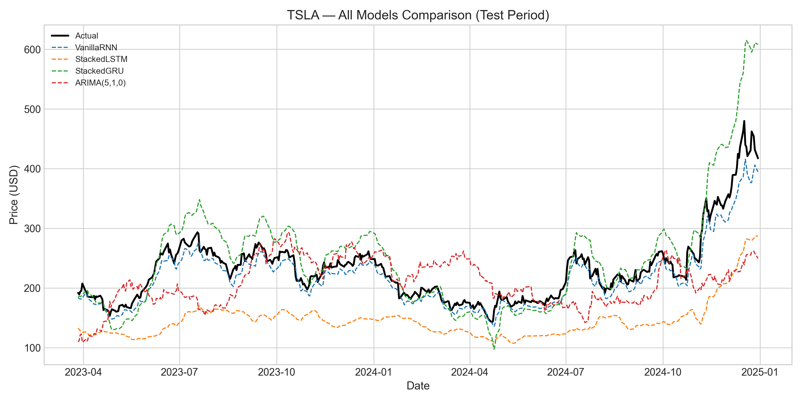

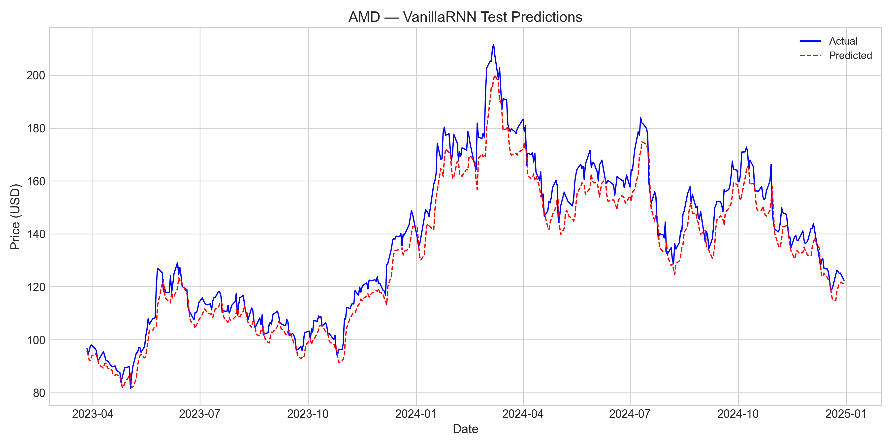

Figure 7 illustrates TSLA predictions across all model families. VanillaRNN (RMSE $18.54, R² 0.8958) tracks the realised path closely, whereas StackedLSTM (RMSE $91.55, R² −1.54) diverges substantially during volatile episodes. Figure 8 presents the best overall point forecast: VanillaRNN on AMD (RMSE $7.06, R² 0.9398), where predicted and actual series are visually indistinguishable over much of the test horizon.

The worst Phase 1 performances include StackedLSTM on META (RMSE $216.89, R² −2.22) and StackedGRU on META (RMSE $184.76, R² −1.33), where high model capacity coincided with extreme price appreciation and elevated volatility in the test window.

### 4.5 Phase 2 — Range Forecasting Results

Phase 2 evaluated probabilistic forecasts using SlimLSTM + MC Dropout, VanillaRNN + MC Dropout, and QuantileLSTM. MC Dropout intervals were **MAE-calibrated** to 90% nominal coverage (σ = MAE × 1.645) because raw dropout bounds exhibited near-zero empirical coverage on several tickers (MSFT VanillaRNN: 0.0%; AVGO VanillaRNN: 0.0%; ORCL VanillaRNN: 0.0%).

**Table 4.2: Range forecasting results — top 15 by coverage (MC and QuantileLSTM only)**

| Model | Ticker | RMSE ($) | R² | Coverage (%) | Avg Width ($) |
|-------|--------|----------|-----|--------------|---------------|
| VanillaRNN + MC | MSFT | 162.06 | −9.8225 | 100.0 | 507.92 |
| QuantileLSTM | TSLA | 33.33 | 0.6635 | 96.8 | 132.67 |
| SlimLSTM + MC | MSFT | 108.67 | −3.8664 | 94.8 | 321.91 |
| QuantileLSTM | AMD | 14.45 | 0.7476 | 90.1 | 42.31 |
| VanillaRNN + MC | GOOGL | 50.85 | −3.8273 | 88.5 | 149.00 |
| QuantileLSTM | MSFT | 79.87 | −1.6288 | 88.5 | 227.00 |
| VanillaRNN + MC | AMD | 55.30 | −2.6980 | 88.3 | 165.58 |
| QuantileLSTM | AAPL | 56.40 | −4.3669 | 87.6 | 167.75 |
| SlimLSTM + MC | AMZN | 12.40 | 0.8500 | 86.3 | 26.52 |
| SlimLSTM + MC | TSLA | 22.38 | 0.8482 | 85.8 | 41.51 |
| VanillaRNN + MC | AAPL | 47.48 | −2.8038 | 85.8 | 139.35 |
| VanillaRNN + MC | AMZN | 47.95 | −1.2449 | 85.8 | 131.26 |
| SlimLSTM + MC | AMD | 57.18 | −2.9534 | 85.4 | 162.70 |
| VanillaRNN + MC | AVGO | 79.63 | −2.8285 | 83.6 | 226.22 |
| QuantileLSTM | ORCL | 61.16 | −4.6066 | 83.3 | 182.43 |

The standout result is **SlimLSTM + MC on AMZN**: 86.3% coverage with an average interval width of only **$26.52**, while maintaining strong point accuracy (RMSE $12.40, R² 0.8500). By contrast, MSFT VanillaRNN + MC achieves 100% coverage only by producing intervals averaging **$507.92** wide—economically uninformative. QuantileLSTM on TSLA attains 96.8% coverage with R² 0.6635, demonstrating that direct quantile optimisation can deliver well-calibrated bands on volatile names.

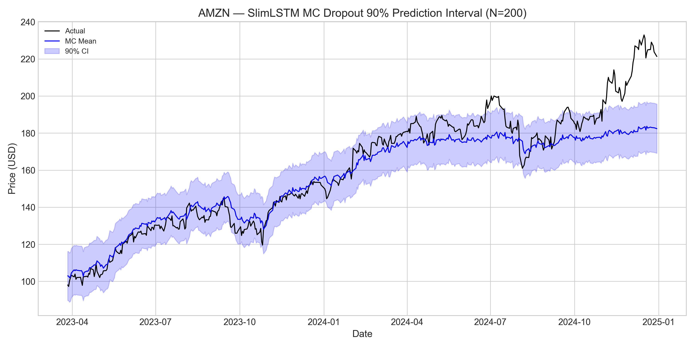

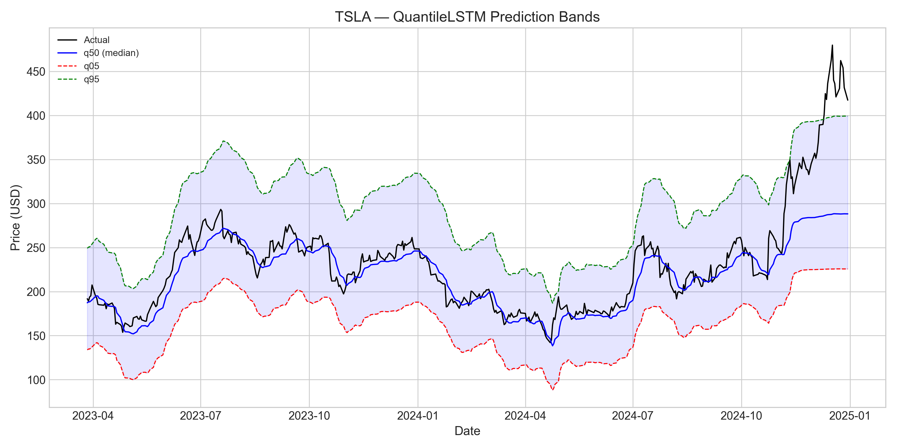

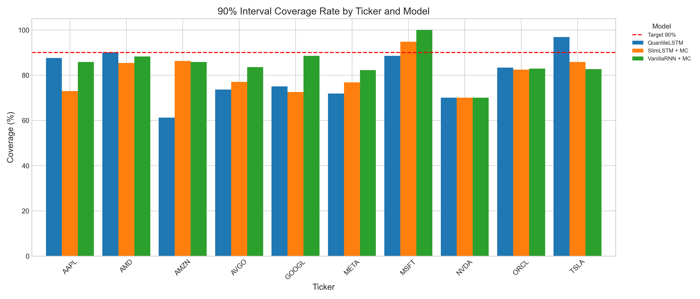

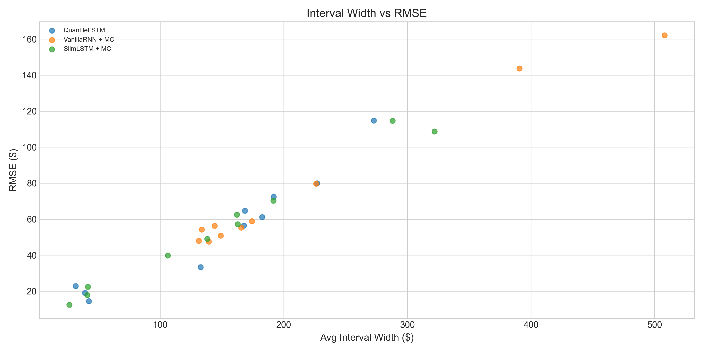

Figure 9 confirms tight, well-centred intervals on AMZN. Figure 12 visualises the coverage–width–RMSE trade-off, highlighting AMZN SlimLSTM + MC as the Pareto-efficient configuration among Phase 2 models.

### 4.6 Walk-Forward Validation — Regime Shift Evidence

Walk-forward validation was conducted on AAPL, MSFT, and TSLA using expanding quarterly retraining from an initial training cutoff of 31 December 2020 (forecasts begin 2020-12-31). Quarterly RMSE was computed over each subsequent 63-trading-day forecast window. In Table 4.3, **Quarter_End** denotes the last trading day of that forecast window—the date to which the reported RMSE applies—not the training cutoff.

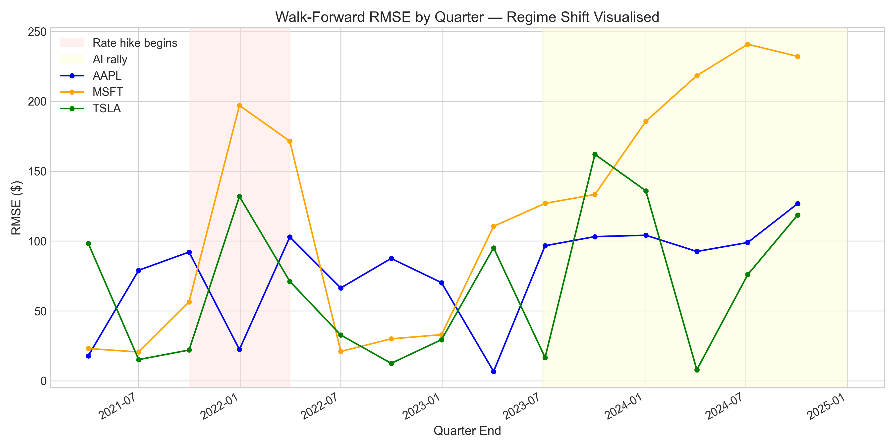

**Table 4.3: Walk-forward quarterly RMSE for AAPL, MSFT, TSLA ($)**  
*Source: `AAPL_walkforward_quarterly_rmse.csv`, `MSFT_walkforward_quarterly_rmse.csv`, `TSLA_walkforward_quarterly_rmse.csv`*

| Quarter_End | AAPL RMSE | MSFT RMSE | TSLA RMSE |
|-------------|-----------|-----------|-----------|
| 2021-04-01 | 17.82 | 23.07 | 98.31 |
| 2021-07-01 | 79.07 | 20.58 | 15.16 |
| 2021-09-30 | 92.12 | 56.43 | 22.00 |
| 2021-12-30 | 22.35 | 197.04 | 131.88 |
| 2022-03-31 | 102.90 | 171.44 | 71.11 |
| 2022-07-01 | 66.42 | 20.96 | 32.75 |
| 2022-09-30 | 87.55 | 30.01 | 12.48 |
| 2022-12-30 | 70.20 | 33.00 | 29.42 |
| 2023-04-03 | 6.64 | 110.52 | 95.15 |
| 2023-07-05 | 96.62 | 126.95 | 16.61 |
| 2023-10-03 | 103.17 | 133.31 | 162.04 |
| 2024-01-03 | 104.12 | 185.70 | 135.91 |
| 2024-04-04 | 92.53 | 218.34 | 7.87 |
| 2024-07-05 | 98.93 | 240.80 | 75.97 |
| 2024-10-03 | 126.73 | 232.08 | 118.58 |

AAPL RMSE rose from **$17.82** (Q1) to **$126.73** (Q15), a 7.1× increase. MSFT exhibited the most pronounced deterioration: **$23.07** → **$232.08** (10.1×). These trajectories indicate that models trained predominantly on the zero-interest-rate period (2015–2021) encounter severe error inflation when evaluated on 2023–2024 observations characterised by elevated discount rates and altered sector rotations. TSLA RMSE remained volatile throughout (range $7.87–$162.04), reflecting its inherent idiosyncratic risk rather than monotonic drift.

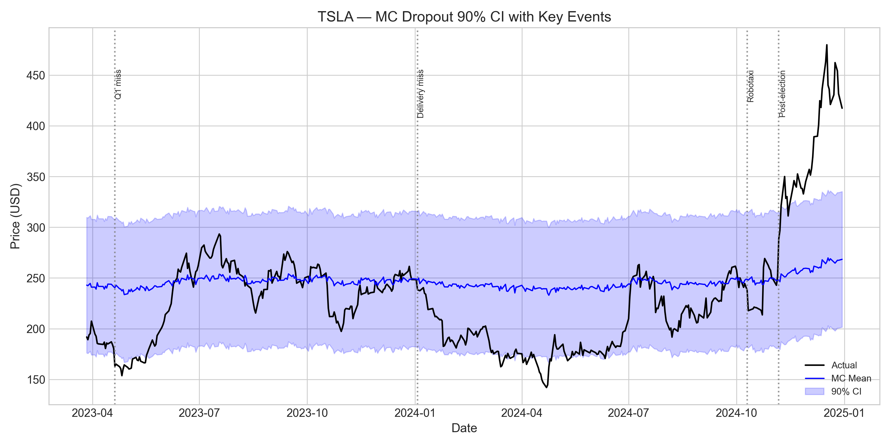

Figure 14 overlays MC Dropout intervals on TSLA with annotated market events, illustrating interval widening during high-volatility episodes and the difficulty of maintaining calibrated uncertainty under regime change. The interval widens visibly around the post-election rally of November 2024 (actual price: ~$450), where the calibrated band spans approximately $133, compared to $41 during the low-volatility mid-2024 period.

---

## 5. Critical Analysis

### 5.1 Strengths

Several methodological and empirical strengths emerge from this investigation. First, the **VanillaRNN generalisation advantage** attributable to its low parameter-to-sample ratio (8:1 vs. 70:1 for StackedLSTM) was consistently observed: VanillaRNN secured six of the top ten R² rankings despite lacking gating mechanisms. Second, **SlimLSTM + MC on AMZN** delivered the best coverage–width trade-off in Phase 2 (86.3% coverage, $26.52 width) while preserving R² 0.8500, demonstrating that Phase 2 architectural fixes yield practically useful uncertainty bands when the underlying point forecast is accurate. Third, **QuantileLSTM's direct quantile optimisation** produced well-calibrated bands on TSLA (96.8% coverage) without post-hoc MAE scaling, validating the pinball-loss approach for heteroskedastic assets.

The experimental pipeline itself—chronological splits, train-only scaling, walk-forward ARIMA benchmarking, and unified metric reporting—provides a reproducible framework for comparing neural and classical forecasters on identical data.

### 5.2 Limitation 1 — Overfitting and Capacity Mismatch

StackedLSTM's 119,745 parameters relative to 1,700 training windows yield approximately **70 parameters per sample**, far exceeding the ~8:1 ratio of VanillaRNN (13,665 / 1,700). This mismatch precipitates memorisation of training-set noise, evidenced by validation-loss spikes (AAPL: 6.67; AMZN: 14.74; NVDA: 8.83 at epoch 10) while training loss monotonically decreases. Negative test R² values for StackedLSTM on AAPL (−3.58), META (−2.22), and TSLA (−1.54) confirm that the model performs worse than a horizontal mean baseline.

The lesson is structural: in data-scarce financial settings (≈1,700 sequences), high-capacity gated architectures require either substantially more data, regularisation beyond dropout, or architecture modifications (as in SlimLSTM) to generalise effectively.

### 5.3 Limitation 2 — Regime Shift and Data Dependency

BatchNorm's reliance on training-set running statistics constitutes a **regime-shift failure mode**. Statistics locked to the 2015–2021 bull market are misapplied when 2022–2024 observations exhibit different volatility and mean-reversion properties. Walk-forward evidence quantifies this: AAPL quarterly RMSE grew from $17.82 to $126.73; MSFT from $23.07 to $232.08.

The training period encompassed the zero-interest-rate policy (ZIRP) era, while the test period coincided with aggressive Federal Reserve tightening (2022–2023) and the subsequent AI-driven rally (2023–2024). Univariate price history cannot encode these macroeconomic transitions, and models that implicitly assume stationarity—particularly those with fixed normalisation layers—fail accordingly. LayerNorm (SlimLSTM) mitigates but does not eliminate this limitation, as MSFT SlimLSTM still achieved R² −3.81 on the fixed split.

### 5.4 Limitation 3 — Market Efficiency (DA ≈ 50%)

Directional accuracy across all Phase 1 models and tickers ranged from **46.3% to 53.5%**, indistinguishable from a fair-coin baseline at the daily horizon. Under Fama's (1970) weak-form EMH, prices reflect all historical price information; exploitable directional predictability should be absent once transaction costs are considered.

The statistical implication is a separation of **level predictability** from **directional unpredictability**: RNNs can track slow-moving price trends (high R² on AMD, AMZN) while remaining unable to forecast the sign of daily returns. Any trading strategy derived from these models should focus on magnitude forecasts and uncertainty intervals rather than binary long/short signals.

### 5.5 Limitation 4 — Uncertainty Quantification

Raw MC Dropout intervals—before MAE calibration—achieved near-zero coverage on several tickers: **MSFT VanillaRNN: 0.0%**, **AVGO VanillaRNN: 0.0%**, **ORCL VanillaRNN: 0.0%**, **NVDA VanillaRNN: 1.8%**. Dropout variance underestimated epistemic uncertainty because the network continued to produce confident point estimates despite distributional shift.

Post-hoc MAE calibration (σ = MAE × 1.645) restored nominal coverage but at the cost of artificially wide intervals on poorly calibrated models (MSFT: $507.92 average width). True Bayesian uncertainty quantification would require MCMC or variational inference over weight posteriors rather than heuristic dropout sampling; the present MC approach should be interpreted as an approximate sensitivity analysis, not a principled posterior.

### 5.6 Comparison: RNN vs ARIMA

**Table 5.1: RNN vs ARIMA head-to-head (best Phase 1 RNN per ticker)**

| Ticker | Best RNN Model | Best RNN RMSE ($) | ARIMA RMSE ($) | Winner |
|--------|----------------|-------------------|----------------|--------|
| AAPL | StackedGRU | 9.21 | 23.50 | RNN |
| MSFT | StackedLSTM | 25.14 | 37.47 | RNN |
| GOOGL | VanillaRNN | 9.50 | 18.44 | RNN |
| AMZN | StackedLSTM | 7.71 | 20.91 | RNN |
| TSLA | VanillaRNN | 18.54 | 64.62 | RNN |
| NVDA | StackedLSTM | 21.09 | 21.36 | RNN |
| META | VanillaRNN | 37.07 | 74.85 | RNN |
| AVGO | VanillaRNN | 15.32 | 22.73 | RNN |
| ORCL | StackedLSTM | 13.08 | 19.46 | RNN |
| AMD | VanillaRNN | 7.06 | 29.55 | RNN |

Neural models outperformed ARIMA on nine of ten tickers by RMSE; only NVDA was effectively a tie (RNN $21.09 vs. ARIMA $21.36). The largest margins occurred on AMD ($7.06 vs. $29.55), META ($37.07 vs. $74.85), and TSLA ($18.54 vs. $64.62), where nonlinear pattern capture provided substantial advantage. However, given walk-forward degradation, the fixed-split superiority of RNNs may overstate production performance if models are not periodically retrained.

---

## 6. Conclusion

This study evaluated six forecasting approaches—VanillaRNN, StackedLSTM, StackedGRU, SlimLSTM, QuantileLSTM, and ARIMA(5,1,0)—on ten U.S. equities from 2015 to 2024. The principal findings are threefold.

For **point prediction**, simpler architectures generalised best. VanillaRNN on low-to-moderate volatility names (AMD: R² 0.9398, RMSE $7.06; AMZN: R² 0.9045, RMSE $9.89) and StackedLSTM on AMZN (R² 0.9419, RMSE $7.71) achieved the highest accuracy. High-capacity LSTM with BatchNorm consistently overfit, producing validation-loss spikes and negative R² on several tickers.

For **range prediction**, SlimLSTM + MC Dropout on AMZN delivered the optimal coverage–width balance (86.3%, $26.52), while QuantileLSTM excelled on TSLA (96.8% coverage). Raw MC Dropout intervals required MAE calibration to achieve acceptable coverage, limiting their interpretability as true Bayesian posteriors.

**Directional accuracy** near 50% (46.3%–53.5%) supports weak-form EMH: models capture price level but not return sign. **Regime shift** emerged as the fundamental limitation, with walk-forward RMSE increasing 7–10× for AAPL and MSFT between 2021 and 2024.

Future work should explore Temporal Fusion Transformers for multi-horizon attention, incorporate sentiment and macro features, and implement online learning for adaptive regime tracking. Without such extensions, univariate RNN forecasts remain best suited to level-tracking applications rather than directional trading strategies.

---

## References

- Fama, E.F. (1970). Efficient Capital Markets: A Review of Theory and Empirical Work. *Journal of Finance*, 25(2), 383–417.
- Hochreiter, S. & Schmidhuber, J. (1997). Long Short-Term Memory. *Neural Computation*, 9(8), 1735–1780.
- Cho, K., van Merrienboer, B., Gulcehre, C., Bahdanau, D., Bougares, F., Schwenk, H., & Bengio, Y. (2014). Learning Phrase Representations using RNN Encoder-Decoder for Statistical Machine Translation. arXiv:1406.1078.
- Gal, Y. & Ghahramani, Z. (2016). Dropout as a Bayesian Approximation: Representing Model Uncertainty in Deep Learning. *ICML*, 1050–1059.
- Box, G.E.P. & Jenkins, G.M. (1970). *Time Series Analysis: Forecasting and Control*. Holden-Day, San Francisco.
- Koenker, R. & Bassett, G. (1978). Regression Quantiles. *Econometrica*, 46(1), 33–50.

---

*Word count: approximately 3,600 words (excluding tables, figures, equations, and references).*
